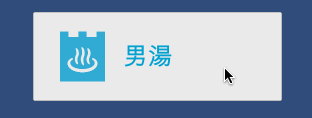
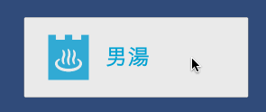
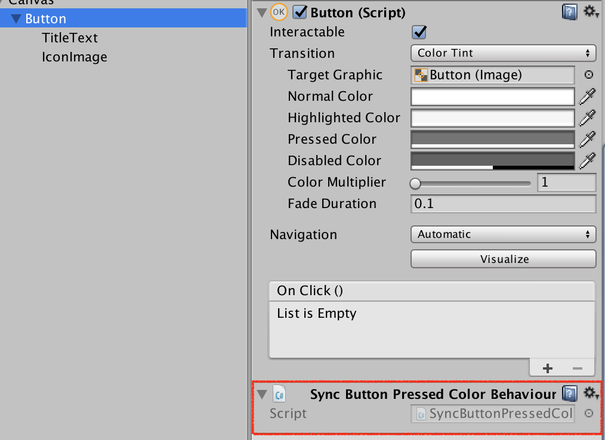

# SyncButtonPressedColorBehaviour

    ->    

## Usage
### 0. Prepare
- This script is use [DOTween](https://www.assetstore.unity3d.com/jp/#!/content/27676).
- Please install by unity asset store.

### 1. Attach
- Please attach to purpose button [this script](Assets/Scripts/SyncButtonPressedColorBehaviour.cs).

## Environment
- Unity 5.6.1f1
- DOTwenn 1.1.575

## License
MIT
